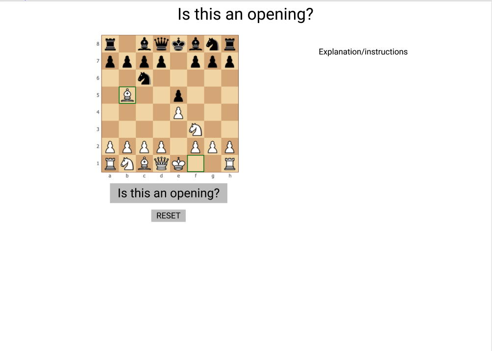
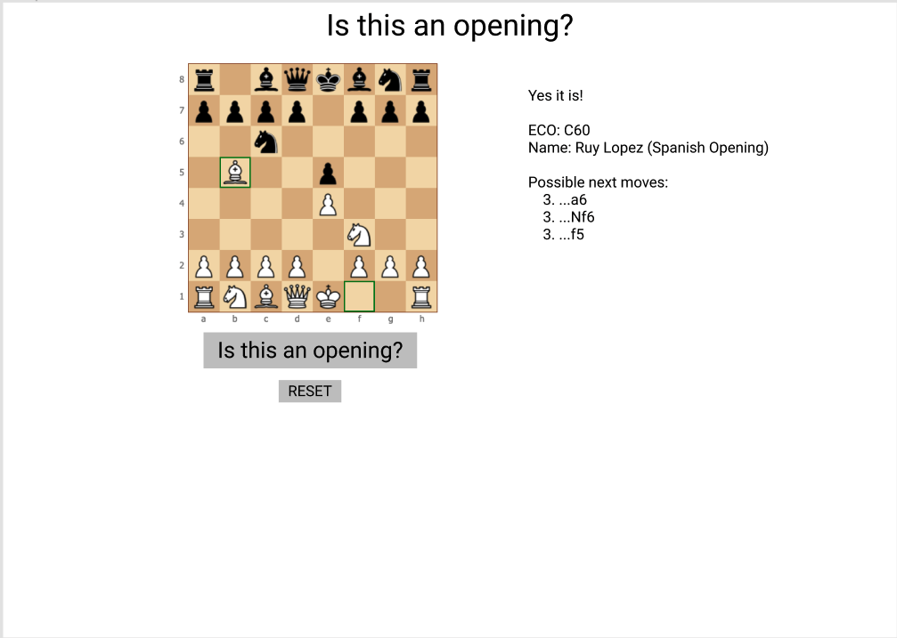
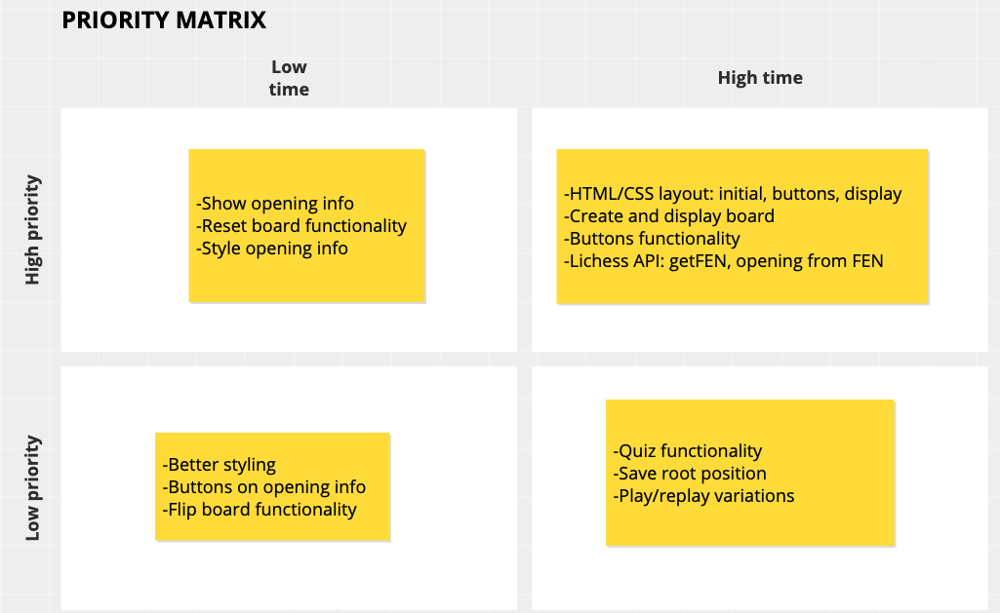

# Project Overview


## Project Name

Is this an opening?

## Project Description

This app helps users explore chess openings from an input board position.

## API and Data Sample

The Lichess opening explorer API is free to use and doesn't require an auth key. By inputting a FEN ([Forsyth-Edwards Notation](https://en.wikipedia.org/wiki/Forsyth%E2%80%93Edwards_Notation): describes a chess board position), the API will return a JSON that includes, among other things, the [ECO](https://en.wikipedia.org/wiki/Encyclopaedia_of_Chess_Openings) code and name of the opening if the position has one. For example,

```
{
    "white": 36446,
    "draws": 60733,
    "black": 23262,
    "moves": [
        {
            "uci": "a7a6",
            "san": "a6",
            "white": 26936,
            "draws": 44584,
            "black": 17189,
            "averageRating": 2425
        },
        {
            "uci": "g8f6",
            "san": "Nf6",
            "white": 5163,
            "draws": 11713,
            "black": 3499,
            "averageRating": 2470
        },
        {
            "uci": "f7f5",
            "san": "f5",
            "white": 1512,
            "draws": 1500,
            "black": 768,
            "averageRating": 2379
        },
        {
            "uci": "g7g6",
            "san": "g6",
            "white": 776,
            "draws": 947,
            "black": 577,
            "averageRating": 2419
        },
        {
            "uci": "f8c5",
            "san": "Bc5",
            "white": 665,
            "draws": 697,
            "black": 384,
            "averageRating": 2388
        },
        {
            "uci": "g8e7",
            "san": "Nge7",
            "white": 649,
            "draws": 655,
            "black": 433,
            "averageRating": 2395
        },
        {
            "uci": "c6d4",
            "san": "Nd4",
            "white": 404,
            "draws": 340,
            "black": 241,
            "averageRating": 2392
        },
        {
            "uci": "d7d6",
            "san": "d6",
            "white": 267,
            "draws": 229,
            "black": 130,
            "averageRating": 2387
        },
        {
            "uci": "f8b4",
            "san": "Bb4",
            "white": 40,
            "draws": 49,
            "black": 28,
            "averageRating": 2404
        },
        {
            "uci": "d8e7",
            "san": "Qe7",
            "white": 14,
            "draws": 4,
            "black": 8,
            "averageRating": 2380
        },
        {
            "uci": "d8f6",
            "san": "Qf6",
            "white": 8,
            "draws": 6,
            "black": 2,
            "averageRating": 2350
        },
        {
            "uci": "f8d6",
            "san": "Bd6",
            "white": 5,
            "draws": 6,
            "black": 0,
            "averageRating": 2267
        }
    ],
    "averageRating": 2429,
    "opening": {
        "eco": "C60",
        "name": "Ruy Lopez"
    },
    "topGames": [
        {
            "id": "jYSkjcuG",
            "winner": "draw",
            "speed": "classical",
            "white": {
                "name": "Carlsen, M.",
                "rating": 2882
            },
            "black": {
                "name": "Caruana, F.",
                "rating": 2818
            },
            "year": 2019
        },
        {
            "id": "Sxov6E94",
            "winner": "white",
            "speed": "classical",
            "white": {
                "name": "Caruana, F.",
                "rating": 2818
            },
            "black": {
                "name": "Carlsen, M.",
                "rating": 2882
            },
            "year": 2019
        },
        {
            "id": "hFigNtet",
            "winner": "draw",
            "speed": "classical",
            "white": {
                "name": "Caruana, F.",
                "rating": 2819
            },
            "black": {
                "name": "Carlsen, M.",
                "rating": 2875
            },
            "year": 2019
        },
        {
            "id": "ezRQfr7f",
            "winner": "black",
            "speed": "classical",
            "white": {
                "name": "Carlsen, M.",
                "rating": 2882
            },
            "black": {
                "name": "Ding Liren",
                "rating": 2805
            },
            "year": 2019
        }
    ]
}
```

## Wireframes




## MVP/Post-MVP

#### MVP

- Use chessboard on page to input moves and get FEN
- Button to get FEN of current position
- Send FEN to Lichess opening API and return opening code and name
- Show opening info or message that position is not in opening encyclopedia
- Allow user to reset board and check another opening

#### PostMVP

- Allow user to input or play following moves and compare against most commonly played next moves
- 'Quiz' that lists openings for user to select which matches current position
- Display main openings/variations that "branch" from current position
- Keep history of moves so player can repeat play from original position

## Project Schedule

| Day          | Deliverable                                        | Status     |
| ------------ | -------------------------------------------------- | ---------- |
| August 27-30 | Prompt / Wireframes / Priority Matrix / Timeframes | Incomplete |
| August 30    | Project Approval                                   | Incomplete |
| August 31    | Core Application Structure (HTML, CSS, etc.)       | Incomplete |
| August 31    | Pseudocode / actual code                           | Incomplete |
| September 1  | Initial Clickable Model                            | Incomplete |
| September 2  | MVP                                                | Incomplete |
| September 3  | Presentations                                      | Incomplete |

## Priority Matrix



## Timeframes

| Component                                  | Priority | Estimated Time | Time Invested | Actual Time |
| ------------------------------------------ | :------: | :------------: | :-----------: | :---------: |
| HTML/CSS: initial layout                   |    H     |      3hrs      |     0hrs      |    0hrs     |
| HTML/CS: buttons/display                   |    H     |      3hrs      |     0hrs      |    0hrs     |
| Create board and getFEN                    |    H     |      3hrs      |     0hrs      |    0hrs     |
| Lichess API                                |    H     |      3hrs      |     0hrs      |    0hrs     |
| Display opening info                       |    H     |      3hrs      |     0hrs      |    0hrs     |
| Style opening info                         |    H     |      3hrs      |     0hrs      |    0hrs     |
| More CSS styling                           |    M     |      3hrs      |     0hrs      |    0hrs     |
| More styling                               |    M     |      3hrs      |     0hrs      |    0hrs     |
| Reset button/function                      |    M     |      3hrs      |     0hrs      |    0hrs     |
| Buttons out of opening info/next moves     |    L     |      3hrs      |     0hrs      |    0hrs     |
| Button for playing next moves              |    L     |      3hrs      |     0hrs      |    0hrs     |
| Save root position for retrying next moves |    L     |      3hrs      |     0hrs      |    0hrs     |
| Flip board button/function                 |    L     |      3hrs      |     0hrs      |    0hrs     |
| Quiz button/function                       |    L     |      3hrs      |     0hrs      |    0hrs     |
| Total                                      |          |     42hrs      |      hrs      |     hrs     |

## Code Snippet

## Change Log
